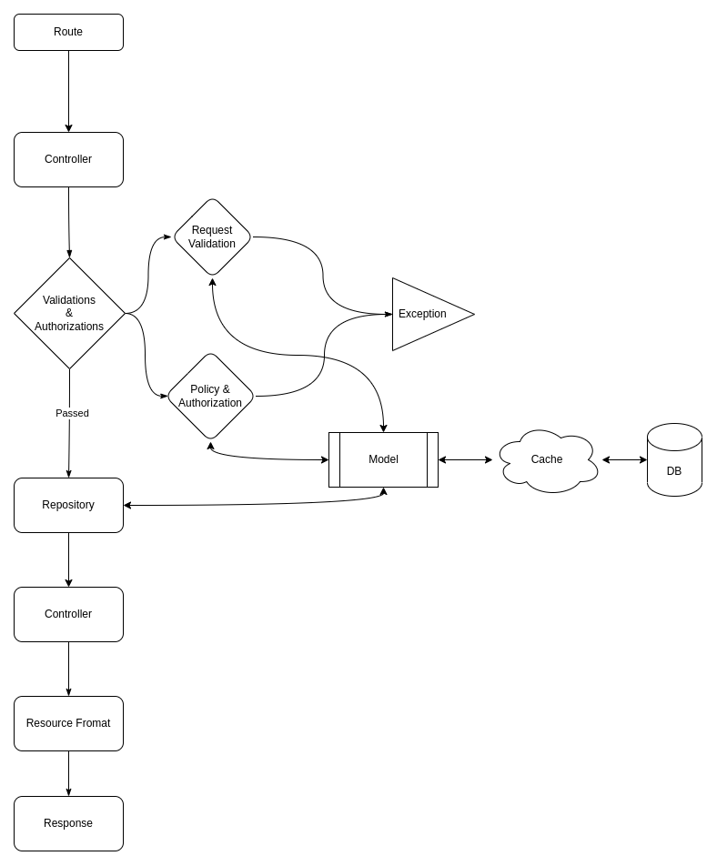

# Laravel-Repositories
[](https://scrutinizer-ci.com/g/mshamaseen/laravel-repositories/build-status/main) [](https://scrutinizer-ci.com/g/mshamaseen/laravel-repositories/?branch=main) [](https://scrutinizer-ci.com/code-intelligence)

A Laravel Repository generator with the best practice and tools already set and ready to be used.

## What this package do?
1. Commands to generate files, including repository files and others.
2. Enforcing single responsibility principle
3. Automatic CRUD out-of-the-box, whenever you generate a repository it will be CRUD-ready.
4. Automatic query searching - (when the frontend send search GET param)
5. Automatic query sorting - (when the frontend send order GET param)
6. Automatic query filtration

## Introduction
This package aim to provide auto file generation and base classes for the repository design pattern on Laravel.

Repository pattern forces you to have repository files in mediate between controllers and models, acting like a container where data access logic and business logic are stored.

### What is wrong with the MVC pattern?

MVC Violate the single responsibility principle in SOLID principles, where controller methods are responsible for the business logic and returning responses to the front-end users in the same time, making it impossible to re-use these methods or to independently testing the business logic in them.

### How repository design pattern works in this package?

After a request is being sent to the Laravel application, it follows these steps:

1. The route catch the request and redirect it to its method in the controller
2. The controller then validate the request with the correct [request file](https://laravel.com/docs/validation#creating-form-requests).
3. If the validations passed, the controller then check the [policy](https://laravel.com/docs/authorization#creating-policies) authorization if available.
4. If it passed the controller then call the repository to retrieve the required data.
5. The repository implement the business logic and call the model to retrieve the required data from the database accordingly.
6. The repository process that data (if needed) and return the final result to the controller
7. The controller passes that data to the [resource file](https://laravel.com/docs/eloquent-resources) to format the data as needed.
8. The controller finally return the response back to the user.



## Quick Usage

Run:

```php
php artisan generate:repository Test
```

This will generate the following files:
1. Test - (the Model file)
2. TestController
3. TestRepository
4. TestRequest
5. TestResource
6. TestPolicy
7. TestTest

Read the full document on [ReadTheDoc](https://laravel-repository-pattern.readthedocs.io/en/latest/index.html).

## LICENSE
MIT License


## Versioning
We follow [Semantic Versioning](https://semver.org/)

## Roadmap
1. add the ability to disable caching from the config.
